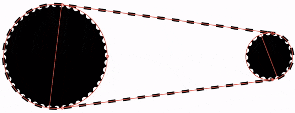

# Pedal Furiously
[Go to calculator](https://pedalfuriously.neocities.org/)

## Help

Pedal Furiously is a an animated bicycle gear calculator. The speed of the bike is calculated based on an approximately 700 x 28c wheel size. 

*Hint: use arrow keys to adjust values precisely.*

## About

Pedal Furiosly is not about being a serious bicycle gear caclulator. There are lots of those online that account for crank length, tire size and all sorts of other things. [Bicycle legend Sheldon Brown's gear calculator](http://www.sheldonbrown.com/gear-calc.html) is probably one of the best. Pedal Furiously is more about fun, and may be useful if you want to get a feel for what pedaling various gears at various speeds will feel like.

This was created to help me learn about a couple of things that I have an amatuer interest in. Things like:
- Making simple web apps
- Vector graphics
- Bicycles

Against my will, I ended up learning about some extra things as well. Things like:
- How much math I have forgotten since high school
- The surprising complications of trying to model a chain driven sprocket system
- The tedious and unrewarding process of getting a web browser to avoid [painting](https://developers.google.com/web/fundamentals/performance/rendering/#the_pixel_pipeline)

### Modeling the Drivetrain

Trying to draw a chain wrapped around two sprockets of arbitrary size led me to the edge of sanity. Looking too deeply in to the secrets of the bicycle drivetrain has apparantly led others there as well. On one BMX racing forum I found an unfortunate soul who had video taped a drivetrain in slow motion for *an hour*, and watched it in excruciating detail. They wanted to determine whether it was the relative diameters of the sprockets, or if it was the number of teeth on them, that determined the true mechanical advantage of the drive system. Their last post was something to the effect of "I'm not sure what to believe anymore". I hope they are doing okay now.

The main failing of my drivetrain drawing module is that the rear sprocket does not mesh perfectly with the chain, leading to a graphical glitch. Drawing one sprocket with a chain wrapped around it, and drawing the straight sections of chain to the other sprocket, is not too much of a struggle (apart from figuring how the heck to draw [two straight lines between two circles](http://mathworld.wolfram.com/Circle-CircleTangents.html)). The problem comes with the second sprocket.

For a given number of chain links, and for particular sprocket sizes, there is only one distance that can seperate these sprockets. If you've tried to make a single speed bike from a frame with vertical dropouts, you'll know all about this. Trying to determine this seperation distance mathematically is, for me, impossible. There are functions online that claim to do it, but they are either [approximations involving mysterious numbers like 0.810](https://www.engineersedge.com/hardware/sprocket_center_distance__13904.htm), or involve so many nested sqaure roots and trig functions that I get dizzy looking at them. 

If you're making a machine, an aproximation is perfect, as the final correction will be done for you by metal compenents meshing in to place. This didn't help me. Even if I could find the exact "center-center" distance, I'd still need to find a rotation for the driven sprocket that makes it mesh visually with the chain. This is beyond the realm of mere mortals.

If anyone knows how to fix this, please tell me.

### Animating SVG, Or Why is my Computer Melting?

I could have made this in [WebGL](https://en.wikipedia.org/wiki/WebGL) with something like [PixiJS](www.pixijs.com). That would have been smart. But I was smitten with the concept of vector graphics, and [SVG](https://youtu.be/SeLOt_BRAqc). Smooth and clean at any resolution. Super small file sizes. Infinite zoom. Vectors are the pizels of the future!

I knew about the performance risks of triggerring a [browser paint](https://developers.google.com/web/fundamentals/performance/rendering/#the_pixel_pipeline) too often, and I was trying to avoid it. I was doing well, until the yellow road lines came in to the picture. The road lines are basically one big fat dashed yellow line that shuttles itself back and forth accross the view box at the right speed. This means that large sections of it are invisibly poking out the side of the view box at any time. Unfortunately, it looks like bits poking out (even invisible ones) always trigger a paint. 

Strategies like recalculating and redrawing the shape of the lines for each frame didn't seem to help performance much, and they were way more complicated.

On my computer, the paint done in each frame takes about 8ms, burning through half of the 16ms budget you get at 60 frames per second. I'm pretty happy with the animation overall, although it only does 60fps reliably on a desktop browser.

If anyone knows how to fix this, please tell me.

### My takeaways from making this

- Knowing the difference between [sprockets](https://en.wikipedia.org/wiki/Sprocket) and [gears](https://en.wikipedia.org/wiki/Gear)
- Knowing animating complex SVG in a high performance way in a browser is kind of hard
- Knowing simple things (like bicycle gears) can be surprisingly complex

[Go to calculator](https://pedalfuriously.neocities.org/)

